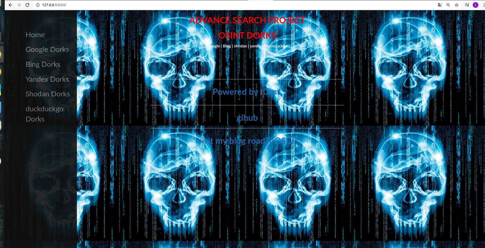
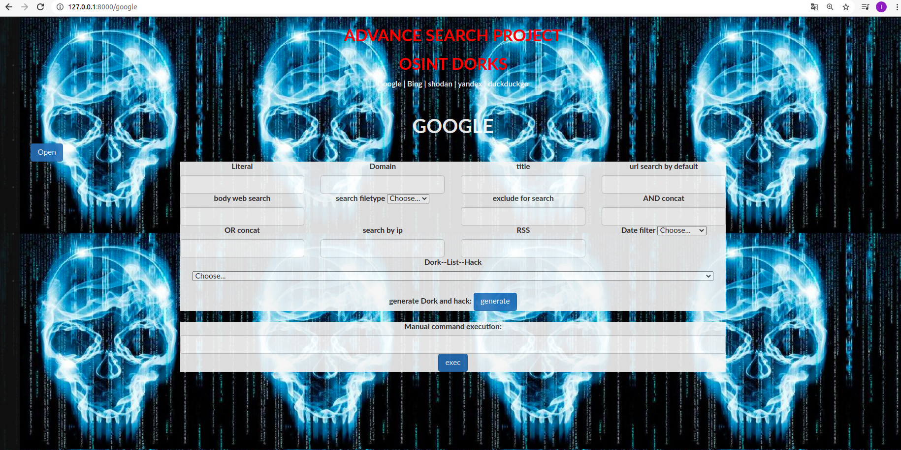

# search_like_expert

** dependencies: 
  -selenium webdriver for python
  -selenium configuration
https://selenium-python.readthedocs.io/installation.html

git clone https://github.com/f0ns1/search_like_expert.git

python3 manage.py runserver

Watching for file changes with StatReloader

Performing system checks...

System check identified no issues (0 silenced).

August 22, 2021 - 09:08:25

Django version 3.2.4, using settings 'dorks_module.settings'

Starting development server at http://127.0.0.1:8000/

Quit the server with CONTROL-C.

Application:

Google Dorks:

